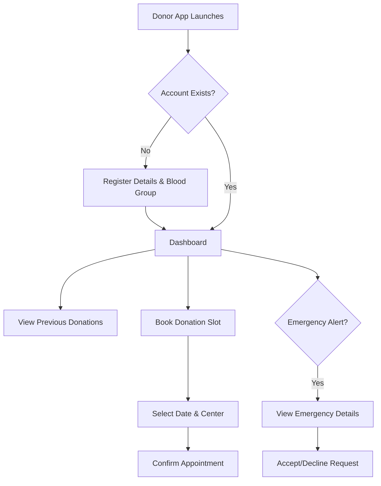
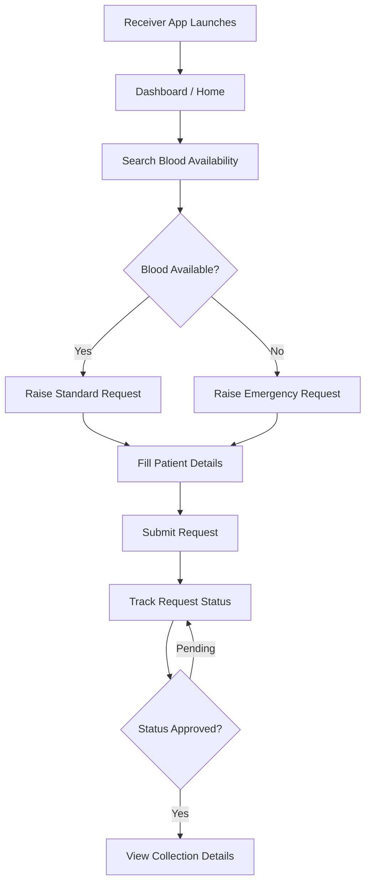
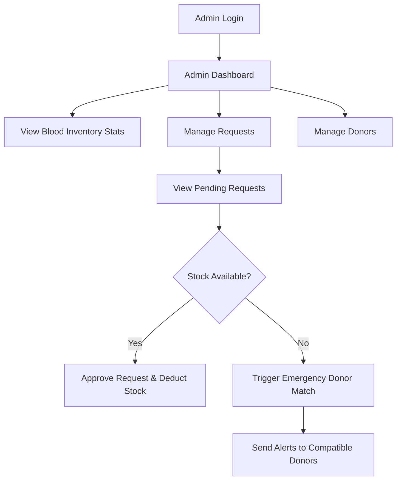
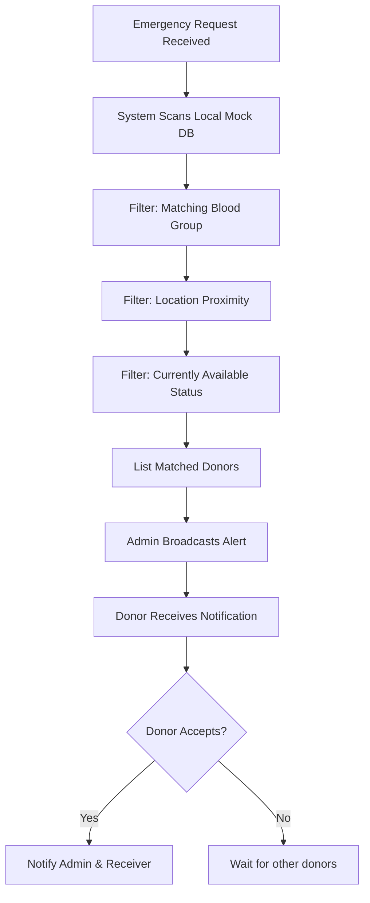
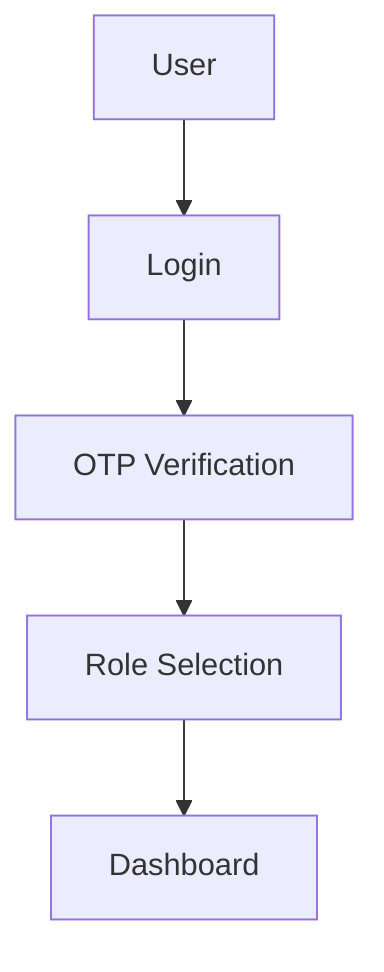
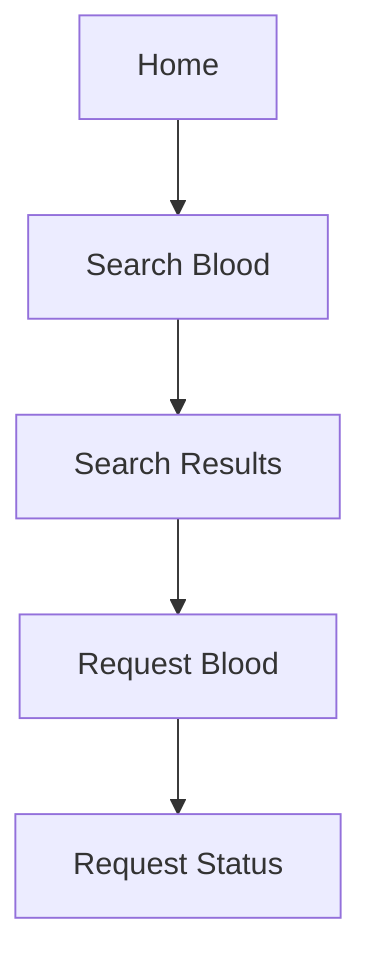
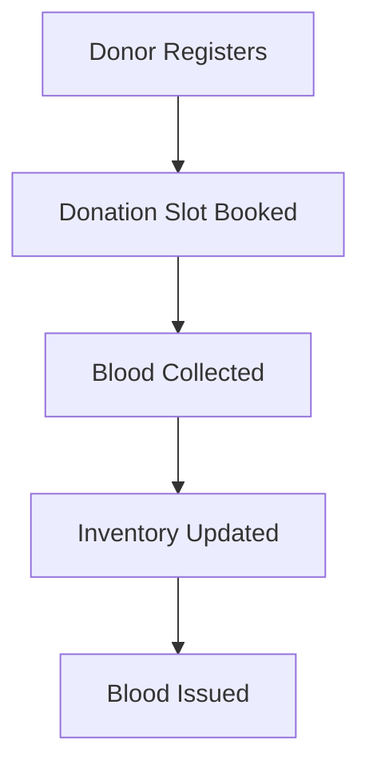
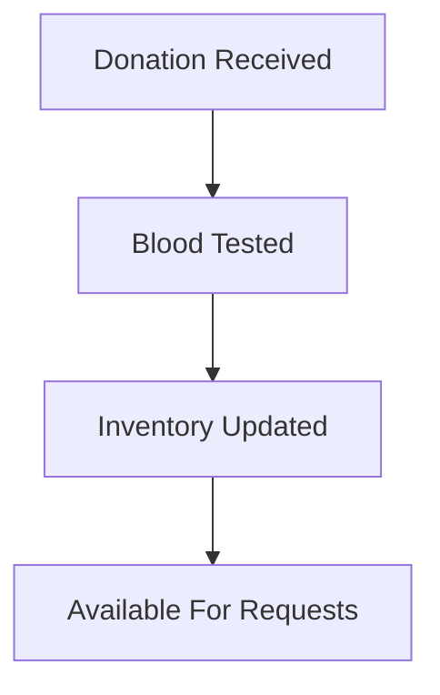

# High Level System Flow & Diagrams
## Sikkim Blood Bank Management System (SBBMS)

### User Types
1. **Blood Bank Admin:** Manages system, inventory, and fulfills requests.
2. **Donor:** Registers to donate and responds to alerts.
3. **Receiver:** Searches for blood and raises requests.

---

### 1. Donor Flow

### 2. Receiver Flow

### 3. Blood Bank Admin Flow

### 4. Emergency Donor Matching Flow

### 5. Authentication Flow

### 6. Main Navigation Flow

### 7. Donation Lifecycle Flow

### 8. Inventory Update Flow

